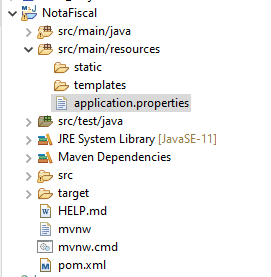

<h1 align="center"> Cadastro de Notas Fiscais e seus Itens </h1>
<p id="sobre" align="center">Projeto Java feito utilizando a framework Spring JDBC. O projeto foi feito para um trabalho do meu curso de Desenvolvimento de Sistemas no SENAI-SP. O seu objetivo era criar uma REST API de "Cadastro de Notas Fiscais e seus Itens", utilizando a framework Spring JDBC e Banco de Dados Relacional MySQL.</p>

<h4 align="center"> 
  🔹 Status: Concluído ✅
</h4>

<p align="center">
 <a href="#sobre">Sobre</a> •
 <a href="#roadmap">Como usar</a> • 
 <a href="#tecnologias">Tecnologias</a> • 
 <a href="#licenca">Licença</a> • 
 <a href="#autor">Autor</a>
</p>

***
***

<h3 align="center">Como Usar</h3>

<br>
<p align="center">1) Antes de qualquer outra coisa, vamos clonar o projeto:</p>

```
git clone https://github.com/eliana-eml/rest-jdbc-project-nota-fiscal
```
<p align="center">Ou</p>

> **IMG DE CLONE E/OU DOWNLOAD DE ZIP**
<br>

***

<p align="center">2) Para que você possa rodar o programa na sua máquina primeiro confira se você possui as seguintes ferramentas instaladas no seu computador:</p>

<br>
<div align="center">
  
 <p align="center"><strong>✔️ <a href="https://www.oracle.com/java/technologies/downloads/">JDK</a> (Java Virtual Machine).</strong></p>
  
  <p align="center"><strong>✔️ Uma <a href="https://www.redhat.com/pt-br/topics/middleware/what-is-ide#:~:text=IDE%2C%20ou%20ambiente%20de%20desenvolvimento,facilitando%20o%20desenvolvimento%20de%20aplica%C3%A7%C3%B5es.">IDE</a> como a <a href="https://www.eclipse.org/downloads/">Eclipse</a> para rodar o seu projeto Java.</strong></p>
  
  <p align="center"><strong>✔️ Um <a href="https://www.oracle.com/br/database/what-is-a-relational-database/">Banco de Dados Relacional</a> como o <a href="https://dev.mysql.com/downloads/">MySQL</a> e um </strong></p>
  
  <p align="center"><strong>✔️ <a href="https://dicasdeprogramacao.com.br/o-que-e-um-sgbd/">SGDB</a> (Sistema Gerenciador de Banco de Dados) como o <a href="https://dev.mysql.com/downloads/workbench/"> MySQL Workbench</a>.</strong></p>
</div>

  <p align="center"><strong>✔️E para nossos testes um <a href="https://www.infoq.com/br/articles/10-ferramentas-teste-api/">API Client</a> de sua escolha, no caso desse projeto eu usei a ferramenta <a href="https://www.postman.com/downloads/">Postman</a>.</strong></p>

***

<br>

<p align="center">3) A seguir você irá abrir o arquivo nota-fiscal.sql no seu MySQL Workbench e em seguida clicar no botão de raio para que ele crie o banco de dados e as tabelas respectivamente.</p>

> **IMG**

***

<br>

<p align="center">4) A seguir vamos importar o projeto em nossa IDE. Lembrando que nesse caso o projeto está sendo importado na Eclipse IDE, então o passo a passo de importação aqui descritos se aplicam a essa IDE, caso você utilize outra IDE o passo a passo podem variar.</p>

> **IMG**

***

<br>

<p align="center">5) A seguir na pasta <strong><i>src/main/resources</i></strong>, clique no arquivo de nome <strong><i>application.properties</i></strong>:</p>

<br>

<div align="center">
  
</div>

***

<br>

<p align="center">6) Em <strong><i>application.properties</i></strong> você irá trocar ambos os campos <strong><i>spring.datasource.username</i></strong> e <strong><i>spring.datasource.password</strong></i>, e colocar o seu <strong><i>nome de usuario</strong></i> e <strong><i>senha</strong></i> do seu MySQL para que assim o programa possa reconhecer o seu banco de dados e as tabelas criadas neles.</p>

```
spring.datasource.username = nomeDeUsuario
spring.datasource.password = senhaDeUsuario
```
> **IMG**

***
***

<h3 align="center">Tecnologias</h3>

<div align="center">
  
  
  
  
  
</div>
